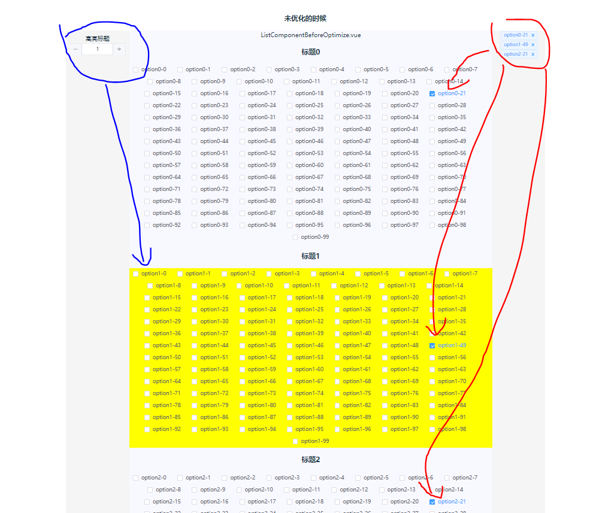

# 主要是记录一次解决交互卡顿的方法

---
- 实际业务场景：
  - 点击左侧标签，例如标题0、标题1、，中间的对应标题的checkboxgroup会滚动到最顶，而中间checkbox的选择会和最右侧的tags选择联动，两者始终保持一致
- 伪代码
  - 伪代码模拟了关键的功能，点击左侧标签改为高亮对应的分组，原理是一样的

---

## 优化效果

- 优化前
  - 业务场景
    - 代码还有其他功能，例如动态的tooltip（涉及js计算），以及更加多的嵌套关系，真实的性能肯定比伪代码要更差一些，每次点击左边标签或选择checkbox，大概会产生200ms左右长任务
  - 伪代码
    - 100ms+

- 优化后
  - 业务场景
    - 每次交互，产生的任务是50ms+
  - 伪代码
    - 10ms+

## 优化过程

### 未优化时组件的结构

 - 传参方式
   - 最左边的选择高亮的标题，通过highLightNo这个prop传给ListComponent组件
   - 最右边的tags通过tags这个prop传给ListComponent，也就是说，这两个prop都会导致ListComponent这个组件的更新

    ListComponent这个组件里面存在大量的el-checkbox，每次任何prop的改变，ListComponent组件更新，更新的时候会把子组件全部都**render->patch**一次，因为checkbox的数量很多，每一个checkbox的**render->patch**时间很短。就造成了长任务

 如下图

 

### 优化方式1

  如果我们不讨论真实业务场景，仅讨论伪代码里面label的显示样式，也就是不需要**自定义checkbox里面label的场景**，其实是不需要用到slot的方式的，

 只需要像黄色圈起的地方这样使用即可
 

 平时很多使用element的组件的时候也没有注意问题，但其实这样会造成性能的巨大差异

 请看main.ts这个引用的文件，这个文件省略了右边tags，因为这个文件仅用来说明slot的影响，不需要右边tags的场景
 

 我们实验一下看看差异
 

 

主要的区别是 不使用插槽的时候没有对每一个checkbox的**render->patch**

---

**什么使用插槽的方式会导致elcheckbox全更新的**

  - 使用插槽

    因为使用插槽，特别是{{xxx}}这种动态插槽，在编译模版时，会把这个组件的patchFlag设为1204，即使在输入高亮标题的时候，对于el-checkbox这个组件来说，props完全没有变化，但是patchFlag在shouldUpdateComponent里面还是任务需要更新，如下图，最后每一个el-checkbox都需要更新了

  - 不使用插槽

    patchFlag是8，并进行前后prop的对比，最后发现prop没变化，于是返回false，所以el-checkbox这个组件并没有再次更新

  

  **这就是为什么使用slot与否性能差距比较大的原因了**

  **_顺带说个有趣的点，就是我们对组件绑定方法的方式不同，也会导致组件的更新不同
  下面 @update:tags的绑定，如果其他prop均没有变化，上面的绑定方式不会导致组件的更新，下面画红框的就会（这个我也没研究为什么，记入to-do-list吧吧吧吧吧吧吧）_**

---

在真实的业务场景下，需要自定义插槽的使用场景颇多，所以还需要其他方式解决问题

**这次的优化核心就是重新安排每个组件的颗粒度，使tags和highLightNo这两个props对组件的影响减少**

#### 优化方式2

  1. 首先，重新切割了ListComponent这个组件的颗粒度

  2. 需要对tags的数据结构修改

  把它变成key-value的对象，能以标题作为key，找到对应的value（选中的checkboxs），实现数据更新也尽量精确到对应的分组，比如我选中和取消选中的tags是属于标题3的，那只有标题3对应的ListItems这个组件需要更新，其他ListItems不需要

  3. highLightNo转换一下再给到ListItems
  -  不转换的话，每次都会把新的0，1，2传给所有的ListItems，会导致所有ListItems更新
  -  转化后，只有highLightNo等于当前分组index，也就是高亮改变的ListItems才需要更新，其他不需要
  -  

这样下来，每次操作高亮分组，点击checkbox，通过tags删除选中checkbox的操作使，都只会影响对应的分组，大大减少了ListItems的更新，从而影响checkbox的更新

最后效果如下

### 优化方式3

看看第二种方式

其实第二种方式和第一种大致是一样的，核心逻辑也是一样的，但是考虑到修改数据结构，例如上面第一种方法提到的，将tags从原来的一维数组换成keyValue对象，可能会引起较大的逻辑变动，无法把握可靠性，那就可以使用v-memo的方法

请看main.ts引用的这个文件

tags并没有像上面一样被改成了对象，依然保留一维数组

只是他的子组件ListItems里面使用了**v-memo**来判断每一个checkbox是否需要更新，如果两次的选中情况一致，则代表不需要更新

！！！！

v-memo的更新判断逻辑是由开发者根据实际情况来制定，例子中只是实现基本的演示功能，伪代码的v-memo判断是有bug的，但其实在这次的业务优化中我们最终也是选择了v-memo

最终效果

